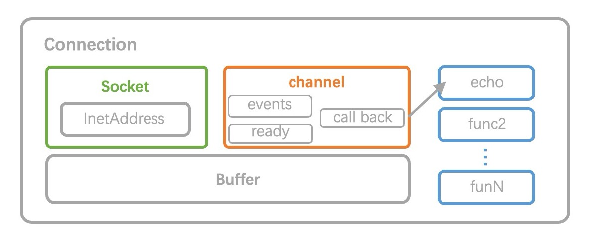

# CppServer

该 CppServer 使用 epoll 实现, 以事件驱动为核心, 并采用 Reactor 设计模式。

# 特点：


1. **Epoll 使用**：服务器利用 epoll 机制进行 I/O 多路复用, 高效处理大量连接。Epoll 的使用使得服务器能够在单个线程中同时处理多个连接, 减少了资源消耗和上下文切换, 提高了并发性能。

2. **事件驱动架构**：服务器采用事件驱动架构, 即通过监听和响应事件来驱动程序执行。这种架构使得服务器能够以非阻塞的方式处理请求, 提高了并发处理能力, 同时也更加灵活和高效。

# 基本socket模型
最基本的Socket模型通常由客户端和服务器端两部分组成：

- 服务器端：服务器端首先创建一个Socket, 并绑定到一个特定的端口上, 然后监听该端口, 等待客户端的连接请求。当客户端连接请求到达时, 服务器端接受连接, 并创建一个新的Socket来处理该连接。服务器端可以通过这个Socket与客户端进行通信, 接收客户端发送的数据, 处理请求, 并向客户端发送响应。
- 客户端：客户端需要知道服务器的地址和端口号。客户端创建一个Socket, 并尝试连接到服务器端。如果连接成功, 客户端可以通过这个Socket与服务器端进行通信, 发送请求并接收响应。


Socket模型的基本操作包括创建Socket、绑定地址和端口、监听连接请求、接受连接、连接到服务器、发送数据和接收数据等。
## BIO(阻塞) and NIO(非阻塞)
UNIX系统中一切且为文件, 每个文件用文件描述符(fd)来标识, 可以对文件进行open/close/read/write等操作。但是这里存在一个问题, 比如说调用read函数读取文件中的数据时, 这个文件有可能为空(没有数据), 则有两种处理方式：
1. BIO: 此时调用read函数的线程被挂起, 直到文件非空, 唤醒线程, 则读取数据后正常返回。
2. NIO: 立即返回, 并标识错误状态。

前者线程被挂起, 函数没有返回, 相当于阻塞状态, 这样的I/O称之为阻塞式I/O。
后者函数立即返回, 相当于非阻塞状态, 这样的I/O称之为非阻塞式I/O。

阻塞式I/O的编程逻辑较非阻塞式的简单, 不用考虑程序执行的状态。
当一个线程被阻塞了, 显然不能响应其他操作, 那么就需要再启动另一个线程来响应其他操作, 所以有多线程编程的需求。
## 多进程/线程
比较传统的服务器并发方式是使用多进程/线程模型, 每来一个客户端连接, 就分配一个进程/线程, 然后后续的读写都在对应的进程/线程, 这种方式处理 100 个客户端没问题, 但是当客户端增大到 10000 个时, 10000 个进程/线程的调度、上下文切换以及它们占用的内存, 都会成为瓶颈。

使用多线程来处理多个客户端的请求, 有两种方式, 一种是有请求就建立一个线程, 另一种是事先建立一定数量的线程(线程池)。
前者在建立, 销毁线程时需要消耗内存资源以及占用CPU时间。两者都会带来线程切换的性能开销, 同时会带来线程安全的问题, 然后就要加锁, 加锁又会降低性能和增加编程复杂度。

多线程中可以使用阻塞I/O进行编程, 阻塞时即挂起线程, 不占用CPU资源。当客户端的数量较少时, 可以采用多线程的方式进行处理。

### 线程池
线程池是由服务器预先创建的一组子线程，线程池中的线程数量应该和CPU数量差不多。线程池中的所有子线程都运行着相同的代码。当有新的任务到来时，主线程将通过某种方式选择线程池中的某一个子线程来为之服务。相比与动态的创建子线程，选择一个已经存在的子线程的代价显然要小得多。
- 空间换时间，浪费服务器的硬件资源，换取运行效率。
- 池是一组资源的集合，这组资源在服务器启动之初就被完全创建好并初始化，这称为静态资源。
- 当服务器进入正式运行阶段，开始处理客户请求的时候，如果它需要相关的资源，可以直接从池中获取，无需动态分配。
- 当服务器处理完一个客户连接后，可以把相关的资源放回池中，无需执行系统调用释放资源。

# IO多路复用
IO多路复用是一种同步的IO模型。利用IO多路复用模型, 可以实现一个线程监视多个文件句柄；一旦某个文件句柄就绪, 就能够通知到对应应用程序进行相应的读写操作；没有文件句柄就绪时就会阻塞应用程序, 从而释放出CPU资源。

IO多路复用使得程序能同时监听多个文件描述符, 能够提高程序的性能, Linux下实现IO多路复用的系统调用主要有select, poll和epoll。

实现形式上, 后台的程序只需要 1 个就可以负责管理多个 fd 句柄, 负责应对所有的业务方的 IO 请求。这种一对多的 IO 模式我们就叫做 IO 多路复用。

**多路**是指？多个业务方（句柄）并发下来的 IO 。\
**复用**是指？复用这一个后台处理程序(进程 or 线程)。

## select ｜ poll
若不想使用多线程带来线程的切换开销和建立线程的内存花销, 可以使用单线程的方式, 那么此时显然就不能有阻塞式的I/O, 否则就不能响应多个请求了。

对于select/poll而言, 它仅仅知道了, 有I/O事件发生了, 却并不知道是哪几个fd（可能有一个, 多个, 甚至全部, 我们只能无差别轮询所有fd, 找出能读出数据, 或者写入数据的fd, 对它们进行操作。所以select具有O(n)的无差别轮询复杂度, 同时处理的流越多, 无差别轮询时间就越长。但是没有多线程带来的缺点(需要同时维护大量线程; 不需要频繁地切换线程，可以更高效地利用CPU)。

对于少量的客户端来说, 多线程和poll这两种服务器模型的CPU占用率差异并不大。但是多线程的内存消耗会更大。

## epoll
epoll是linux2.6内核的一个新的系统调用，epoll在设计之初，就是为了替代select, poll线性复杂度的模型，epoll的时间复杂度为O(1), 也就意味着，epoll在高并发场景，随着文件描述符的增长，有良好的可扩展性。

select和poll监听文件描述符list，进行一个线性的查找 O(n)
epoll: 使用了内核文件级别的回调机制O(1)

### 关键函数
- `epoll_create1()`: 创建一个epoll实例，返回文件描述符
- `epoll_ctl()`: 将监听的文件描述符添加到epoll实例中，实例代码为将标准输入文件描述符添加到epoll中
- `epoll_wait()`: 等待epoll事件从epoll实例中发生， 并返回事件以及对应文件描述符

### 原理

1. epoll 在内核里使用红黑树存储fd，以及对应的回调函数，其插入，查找，删除的性能不错，IO性能不会随着监听的文件描述的数量增长而下降; 相比于hash，不必预先分配很多的空间。。
2. epoll 使用事件驱动的机制，从`epoll_wait()`醒来的时候就能精确的拿到就绪的 fd 数组，不需要任何测试，拿到的就是要处理的fd集合。epoll 使用事件驱动的机制，内核里维护了一个「链表」来记录就绪事件，只将有事件发生的 Socket 集合传递给应用程序，不需要像 select/poll 那样轮询扫描整个集合（包含有和无事件的 Socket ），大大提高了检测的效率。

### epoll LT与ET 模式
#### LT(水平触发)
epoll的默认方式。当epoll_wait检测到其上有事件发生并将此事件通知应用程序后，应用程序可以不立即处理该事件，这样，当应用程序下一次调用epoll_wait时，epoll_wait还会向应用程序通告此事件，直到该事件被处理。缓冲区剩余未读尽的数据会导致epoll_wait返回.

1. 用户不读数据，数据一直在缓冲区，epoll会一直通知
2. 用户只读了一部分数据，epoll会通知
3. 缓冲区的数据读完了，不通知
#### ET(边缘触发)
当epoll_wait检测到其上有事件发生并将此事件通知应用程序后，应用程序必须立即处理该事件，因为后续的epoll_wait调用将不在向应用程序通告此事件。
1. 用户不读数据，数据一致在缓冲区中，epoll下次检测的时候就不通知了
2. 用户只读了一部分数据，epoll不通知
3. 缓冲区的数据读完了，不通知

一般来说，边缘触发的效率比水平触发的效率要高，因为边缘触发可以减少 epoll_wait 的系统调用次数，系统调用也是有一定的开销的的，毕竟也存在上下文的切换。select/poll 只有水平触发模式，epoll 默认的触发模式是水平触发，但是可以根据应用场景设置为边缘触发模式。

> 如果使用边缘触发模式，I/O 事件发生时只会通知一次，而且我们不知道到底能读写多少数据，所以在收到通知后应尽可能地读写数据，以免错失读写的机会。因此，我们会**循环**从文件描述符读写数据，那么如果文件描述符是阻塞的，没有数据可读写时，进程会阻塞在读写函数那里，程序就没办法继续往下执行。所以，边缘触发模式一般和非阻塞 I/O 搭配使用，程序会一直执行 I/O 操作，直到系统调用（如 `read` 和 `write`）返回错误，错误类型为 `EAGAIN` 或 `EWOULDBLOCK`。

# 主从Reactor多线程模式
服务器以事件驱动作为核心, 服务器线程只负责mainReactor的新建连接任务, 同时维护一个线程池, 每一个线程也是一个事件循环, 新连接建立后分发给一个subReactor开始事件监听, 有事件发生则在当前线程处理。

> 概括来讲Reactor多线程 = IO多路复用 + 线程池

1. 服务器一般只有一个main Reactor, 有很多个subReactor。Reactor主线程mainReactor对象通过epoll监听连接事件，收到事件后，通过Acceptor处理连接事件。
2. 当Acceptor处理连接事件后，MainReactor将连接分配给subReactor。服务器管理一个线程池, 每一个subReactor由一个线程来负责Connection上的事件循环, 事件执行也在这个线程中完成。
3. main Reactor只负责Acceptor建立新连接，然后将这个连接分配给一个sub Reactor。这里采用了最简单的hash算法实现全随机调度，即将新连接随机分配给一个subReactor。由于socket fd是一个int类型的整数，只需要用fd余subReactor数，即可以实现全随机调度。
   ```c++
   int random = sock->getFd() % subReactors.size();    //调度策略：全随机
   Connection *conn = new Connection(subReactors[random], sock);   //分配给一个subReactor
   ```
4. 当有新事件发生时，SubReactor就会调用对应的handler进行各种事件处理。handler通过read读取数据，分发给后面的work线程处理。
5. work线程池分配独立的work线程进行业务处理，并返回结果。handler收到响应的结果后，再通过send返回给client。

> 用生活案例来说明，则主从Reactor多线程模式 = 1个前台(Acceptor) + 多个服务员(subReactor)
>
> 由一个服务员接待一组各个客户

# 架构


本服务器采用 主从Reactor 设计模式, 将功能分成两个主要组件：
   - **Acceptor（接收新连接）**：负责监听并接受新的连接请求。当有新的客户端连接请求到达时, Acceptor 负责接受这些连接, 并将新连接分配给相应的 Connection 进行处理。
   - **Connection（维护TCP连接）**：是服务器与客户端建立的连接。每个连接对象负责管理一个已建立的连接, 包括读取数据、处理请求、发送响应等操作。Connection 对象通常会关联一个事件处理器, 用于处理与该连接相关的各种事件, 例如数据到达、连接断开等。
   
主要组件:
- `Acceptor`: Reactor中接受新连接的部分。
- `Connection`: 把TCP连接抽象成一个Connection类。Connection类和Acceptor类是平行关系，他们都直接由`Server`管理。
- `Channel`: 一个`Channel类`自始至终只负责一个文件描述符，对不同的服务、不同的事件类型，都可以在类中进行不同的处理，而不是仅仅拿到一个int类型的文件描述符。
- `Epoll`: 将`sys/epoll.h`的使用方法抽象成类，方便使用。并且使用了epoll的channel用法, 内核发出事件通知时，取出的user_data不是简单的fd，而是一个`Channel指针`，包含关于这个连接的更多信息(如回调函数)。
- `EventLoop`: 不管是主线程Acceptor还是工作线程subReactor都是靠EventLoop驱动的，每个EventLoop都手持一个Epoll, EventLoop内部循环调用`Epoll::poll()`监听各自Channel数组上的事件，监听到活跃事件后就将活跃的Channel包装成数组返回给EventLoop,然后EventLoop遍历这个数组逐个触发其上事件。一个Server持有的EventLoop指针包括一个`mainReactor`(监听新连接)和一个组`SubReactor`(监听一组连接上的消息)。
- `Socket`: 将`sys/socket.h`的使用方法抽象成类，方便使用。
- `ThreadPool`: 线程池，为了避免服务器负载不稳定，这里采用了固定线程数的方法，即启动固定数量的工作线程，一般是CPU核数（物理支持的最大并发数），然后将任务添加到任务队列，工作线程不断主动取出任务队列的任务执行。这里使用one thread per loop的模式，即一个subReactor对应一个线程，由这个线程处理subReactor中的各个事件。


# build & run

- server: echo server(反射client发送内容给client)
- single client: 向服务器发送输入内容
- multiple_clinet: 多线程实现的多个客户端, 向服务器发送"I'm client!"。可以指定线程(client)数量, 每个client发送msg数量，每个client等待时间

```shell
mkdir build && cd build
cmake ..
make server
make single_client
make multiple_client
cd bin
./server
./single_client(or ./multiple_client)
```

<!-- # 代码风格工具
- format：作为一个大型C++项目, 可能有许多程序员共同开发, 每个人的编码习惯风格都不同, 整个项目可能风格杂乱, 可读性差, 不利于项目维护。所以在写C++代码时应该遵守一些约定, 使代码的风格统一。目前比较流行的C++代码风格有google、llvm等, 本项目采用google风格。
- cpplint：基于google C++编码规范的静态代码分析工具, 可以查找代码中错误、违反约定、建议修改的地方。
- clang-tidy：clang编译器的代码分析工具, 功能十分强大。既可以查找代码中的各种静态错误, 还可以提示可能会在运行时发生的问题。不仅如此, 还可以通过代码分析给出可以提升程序性能的建议。 -->
